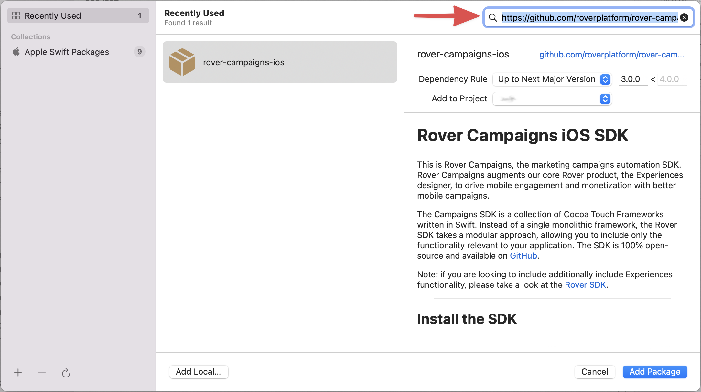
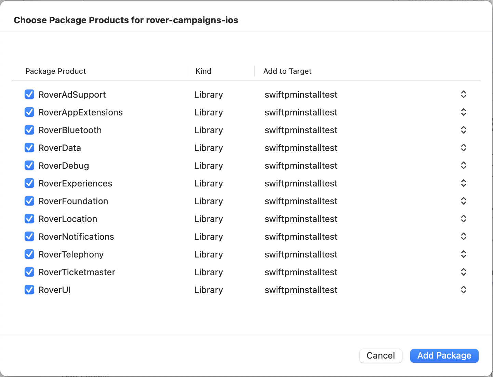

# Rover Campaigns iOS SDK

This is Rover Campaigns, the marketing campaigns automation SDK from Rover. Rover Campaigns augments our core Rover Experiences product to enable mobile engagement and monetization with better mobile campaigns.

<hr />

The Campaigns SDK is a collection of Cocoa Touch Frameworks written in Swift. Instead of a single monolithic framework, the Rover SDK takes a modular approach, allowing you to include only the functionality relevant to your application. The SDK is 100% open-source and available on [GitHub](https://github.com/RoverPlatform/rover-campaigns-ios).

---

## Install the SDK

### SwiftPM

The recommended way to install the Rover Campaigns SDK is via SwiftPM.

In Xcode, in your Project Settings, under Package Dependencies, add a new dependency with the URL of this repository: `https://github.com/roverplatform/rover-campaigns-ios`.

Note that as of Xcode 13, you have to type the repository URL into the search box and press return.



Leave the dependency rule at the default, "Up To Next Major Version".  Rover follows the standard semver semantic versioning rules.

Then, in the subsequent dialog box, choose the Package Products (frameworks) you wish to use.



### Cocoapods

As an alternative, you can use [Cocoapods](http://cocoapods.org/).

The Rover [Podspec](https://guides.cocoapods.org/syntax/podspec.html) breaks each of the Rover frameworks out into a separate [Subspec](https://guides.cocoapods.org/syntax/podspec.html#group_subspecs).

The simplest approach is to specify `Rover` as a dependency of your app's target which will add all required and optional subspecs to your project.

```ruby
target 'MyAppTarget' do
  pod 'RoverCampaigns', '~> 3.9.3'
end
```

Alternatively you can specify the exact set of subspecs you want to include.

```ruby
target 'MyAppTarget' do
    pod 'RoverCampaigns/Foundation',    '~> 3.9.3'
    pod 'RoverCampaigns/Data',          '~> 3.9.3'
    pod 'RoverCampaigns/UI',            '~> 3.9.3'
    pod 'RoverCampaigns/Notifications', '~> 3.9.3'
    pod 'RoverCampaigns/Location',      '~> 3.9.3'
    pod 'RoverCampaigns/Debug',         '~> 3.9.3'
end
```

## Next Steps

Please continue onwards from https://github.com/RoverPlatform/rover-campaigns-ios/wiki.
